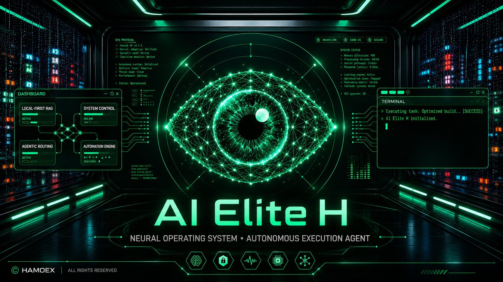

<div align="center">



# AI ELITE

### The Autonomous Neural OS Agent

<br>

<a href="https://github.com/Hamoex/AIProject/stargazers">
  
</a>
<a href="https://github.com/Hamoex/AIProject/network/members">
  
</a>
<a href="https://github.com/Hamoex/AIProject/releases/latest">
  
</a>
<a href="https://github.com/Hamoex/AIProject/releases">
  
</a>
<a href="https://github.com/Hamoex/AIProject/issues">
  
</a>
<a href="LICENSE">
  
</a>

<br><br>

**A local-first AI Operating System layer that turns intent into real OS actions.**

*Speak your command. AI Elite executes it.*

<br>

<a href="https://github.com/Hamoex/AIProject/releases/latest">
  
</a>

---

</div>

## Table of Contents

- [Overview](#overview)
- [Features](#features)
- [Architecture](#architecture)
- [Tech Stack](#tech-stack)
- [Security](#security)
- [Installation](#installation)
- [Configuration](#configuration)
- [Auto-Update](#auto-update)
- [Project Structure](#project-structure)
- [Contributing](#contributing)
- [Roadmap](#roadmap)
- [Disclaimer](#disclaimer)
- [Author](#author)
- [License](#license)

---

## Overview

AI Elite is not a chatbot. It is a **local-first AI Operating System layer** that executes real-world actions across your system, applications, and devices.

> No mouse. No keyboard. Just voice and intent.

---

## Features

<details>
<summary><strong>System & File Management</strong></summary>

| Capability | Description |
|------------|-------------|
| Open / Close App | Native application lifecycle control |
| Read Directory | Local folder scanning & indexing |
| Create Folder | Instant directory structure generation |
| Read / Write File | Deep text extraction & autonomous disk writes |
| Smart Drop Zones | Viral, autonomous folder sorting |

</details>

<details>
<summary><strong>Vector Search & Local Knowledge</strong></summary>

| Capability | Description |
|------------|-------------|
| Index Folder | Semantic LanceDB directory ingestion |
| Smart File Search | Vector-based local file retrieval |
| Read Gallery | Local image cache scanning |
| Analyze Photo | Direct multimodal vision processing |

</details>

<details>
<summary><strong>Developer & Terminal Tools</strong></summary>

| Capability | Description |
|------------|-------------|
| Run Terminal | Native shell & CLI execution |
| Open Project | Instant IDE workspace loading |
| Ghost Coder | Inline IDE generation (Ctrl+Alt+Space) |
| Screen Peeler | OCR visual-to-code extraction |
| Deploy Wormhole | Expose localhost to public internet |

</details>

<details>
<summary><strong>Desktop UI, Vision & Automation</strong></summary>

| Capability | Description |
|------------|-------------|
| Teleport Windows | Dynamic desktop window management |
| Create Widget | Spawn live floating desktop components |
| Click / Scroll / Type | AI-driven exact coordinate targeting |
| Phantom Typer | Global inline clipboard injection |
| Take Screenshot | Instant visual context capture |

</details>

<details>
<summary><strong>Memory & Information</strong></summary>

| Capability | Description |
|------------|-------------|
| Save Core Memory | Deep persistent identity tracking |
| Retrieve Memory | Instant past context recall |
| Save / Read Notes | Local markdown note generation |
| Read Emails | Gmail inbox scraping & summarization |

</details>

<details>
<summary><strong>Web, Media & Financials</strong></summary>

| Capability | Description |
|------------|-------------|
| Google Search | Live internet data retrieval |
| Get Weather | Real-time atmospheric condition checks |
| Open Map | Interactive dark-mode map loading |
| Play Spotify | Instant music & playlist execution |
| Stock Price | Real-time financial ticker tracking |
| Breaking News | Live GNews-powered headlines |
| Build Animated Web | Agentic Tailwind & GSAP generation |

</details>

<details>
<summary><strong>Communications</strong></summary>

| Capability | Description |
|------------|-------------|
| Send / Schedule WhatsApp | Automated & cron-based message dispatch |
| Draft / Send Email | Autonomous composition & direct dispatch |

</details>

<details>
<summary><strong>Mobile Telekinesis</strong></summary>

| Capability | Description |
|------------|-------------|
| Mobile Notifications | Read texts from connected phone |
| Mobile Info | Battery & hardware telemetry |
| Push / Pull File | Seamless PC-to-phone transfers |
| Open / Close Mobile App | Remote Android app control |
| Tap / Swipe Mobile | Remote coordinate touch & scroll |
| Toggle Hardware | Remote Wi-Fi / Bluetooth / Flashlight |

</details>

<details>
<summary><strong>Autonomous Research & Deep RAG</strong></summary>

| Capability | Description |
|------------|-------------|
| Deep Research | Autonomous Llama 3 web crawling |
| Read Notion Reports | Deep sync with Notion databases |
| Ingest Codebase | Local project vector embedding |
| Consult Oracle | Local codebase RAG queries |

</details>

<details>
<summary><strong>Security & OS Vault</strong></summary>

| Capability | Description |
|------------|-------------|
| Lock System Vault | Standard PIN OS lockdown protocol |
| Biometric Encryption | Multi-face recognition OS lockdown |

</details>

---

## Architecture

```
┌─────────────────────────────────────────────────┐
│                  RENDERER (React)                │
│         UI / Voice / Widgets / Animations        │
├──────────────────────┬──────────────────────────┤
│     IPC BRIDGE       │   window.electron         │
│     (Preload)        │   .ipcRenderer.invoke()   │
├──────────────────────┴──────────────────────────┤
│               MAIN PROCESS (Node.js)             │
│    OS Control / AI / Automation / File System     │
└─────────────────────────────────────────────────┘
```

---

## Tech Stack

| Layer | Technology |
|-------|-----------|
| Desktop | Electron + Vite |
| Frontend | React 19, Tailwind CSS v4, Framer Motion, GSAP |
| 3D | Three.js, React Three Fiber |
| State | Zustand |
| AI | Google Gemini, Groq SDK, Hugging Face |
| Vector DB | LanceDB |
| Automation | Nut.js, Puppeteer, Tesseract.js |
| Auth | Google OAuth 2.0, bcrypt, OS keychain |
| Notifications | GNews API |

---

## Security

- **100% BYOK** — Bring Your Own Key
- **Local encryption** via OS keychain (safeStorage)
- **Zero-trust architecture** — no external key storage
- **Biometric vault** with face-api.js recognition
- **PIN lockdown** with bcrypt hashing

---

## Installation

### Download (Recommended)

<a href="https://github.com/Hamoex/AIProject/releases/latest">
  
</a>

1. Download the latest `Ai Elite H Setup x.x.x.exe` from [Releases](https://github.com/Hamoex/AIProject/releases/latest)
2. Run the installer (Windows Defender exclusion is handled automatically)
3. Launch AI Elite from your desktop shortcut

### Build from Source

```bash
git clone https://github.com/Hamoex/AIProject.git
cd AIProject
npm install
npm run dev
```

---

## Configuration

AI Elite requires API keys for its AI engines. Keys are **encrypted and stored locally** on your machine.

### Required Keys

| Key | Source | Purpose |
|-----|--------|---------|
| **Gemini API** | [Google AI Studio](https://aistudio.google.com/app/apikey) | Primary reasoning engine |
| **Groq API** | [Groq Console](https://console.groq.com/keys) | Ultra-fast agent routing |

### Optional Keys

| Key | Source | Purpose |
|-----|--------|---------|
| **Tavily Search** | [Tavily Portal](https://app.tavily.com/home) | Deep Research web crawling |
| **Hugging Face** | [HF Tokens](https://huggingface.co/settings/tokens) | Local model inference |
| **GNews API** | [GNews.io](https://gnews.io) | Breaking News headlines |

### How to Set Keys

Open AI Elite > **Settings** (Command Center) > **Vault** tab > Paste your keys.

---

## Auto-Update

AI Elite includes **built-in auto-updates** via GitHub Releases.

| Setting | Value |
|---------|-------|
| Provider | GitHub |
| Repository | [Hamoex/AIProject](https://github.com/Hamoex/AIProject) |
| Update Check | On app startup |
| Install | Automatic download + restart |

When a new version is published on GitHub, the app will:
1. Check for updates on startup
2. Download the update silently
3. Prompt to restart and install

---

## Project Structure

```
AIProject/
├── build/                  # NSIS installer config & icons
│   └── customInstall.nsh   # Windows Defender exclusion hook
├── out/                    # Compiled output (ready to package)
│   ├── main/               # Electron main process
│   ├── preload/            # IPC bridge scripts
│   └── renderer/           # React frontend + AI models
├── resources/              # App icons & auto-update config
│   ├── app-update.yml      # GitHub auto-update settings
│   └── icon.ico            # Application icon
├── release/                # Build output (installers)
├── assets/                 # Banner images
├── afterPack.js            # Post-build hook
├── build-protected.js      # Build script
├── package.json            # Dependencies & electron-builder config
└── eng.traineddata         # Tesseract OCR language data
```

---

## Contributing

1. **Fork** the repository
2. **Branch** off `main`
3. **Match** existing patterns
4. **Test** thoroughly
5. **Submit** a PR with a clear explanation

See [CONTRIBUTING.md](CONTRIBUTING.md) for full guidelines.

---

## Roadmap

- [x] Voice-first execution
- [x] Breaking News integration
- [x] Auto-update via GitHub
- [ ] Plugin marketplace
- [ ] Memory graph
- [ ] Multi-agent system
- [ ] Desktop + Cloud hybrid

---

## Disclaimer

AI Elite has deep system-level execution capabilities. Use responsibly. The maintainers are not liable for misuse.

---

## Author

**Hamoex**

- GitHub: [@Hamoex](https://github.com/Hamoex)

---

## License

MIT License — see [LICENSE](LICENSE).

<div align="center">

**AI Elite is not a chatbot. It is a neural extension of your operating system.**

*System Online.*

</div>
